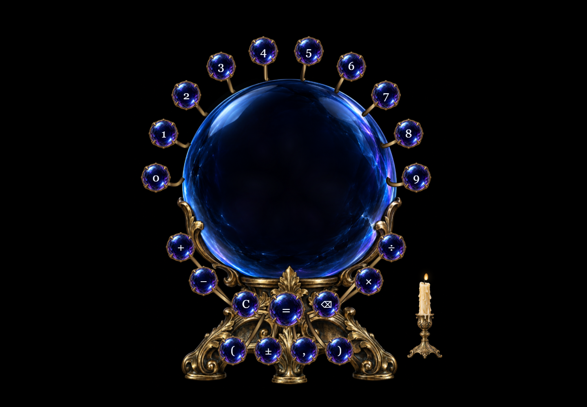

# Magic Orb Calculator

Ein lokal laufender Kristallkugel-Taschenrechner mit eigenen Grafikassets, sicherem Parser, Canvas-Rauch und animiertem Zauberer. Vanilla HTML/CSS/JavaScript, ohne Laufzeitabhängigkeiten, externe Requests oder Tracking.



## Starten

Node.js 20 oder neuer installieren, dann im Repository:

```sh
npm start
```

Im Browser **http://127.0.0.1:4173** öffnen. Für die App selbst ist kein `npm install` nötig. Die statischen Dateien können außerdem von jedem normalen Webserver ausgeliefert werden; ES-Module erfordern HTTP statt direktem `file://`-Öffnen.

## Bedienung

- Ziffern, `+`, `-`, `*`, `/`, Klammern und Komma oder Punkt eingeben.
- Enter berechnet, Backspace entfernt ein Zeichen, Escape bzw. `C` setzt sofort zurück.
- `±` wechselt das Vorzeichen der letzten Zahl.
- Die Kerze schaltet den Ton um; die Einstellung wird lokal gespeichert.
- Nach einem Ergebnis setzt ein Operator die Rechnung fort; eine Ziffer beginnt neu.
- Es gibt weder Verlauf noch wissenschaftliche Funktionen. Exponentialschreibweise ist ausschließlich eine kompakte Ergebnisdarstellung.

## Tests

```sh
npm ci
npm test
npm run test:browser
npm run capture
```

Die Browserprüfungen verwenden einen installierten Microsoft Edge. Für andere Systeme in `playwright.config.js` den Kanal anpassen oder Playwright-Chromium installieren. Die Tests starten bei Bedarf den lokalen Server. Unter Linux/macOS die `webServer.command`-Zeile auf `npm start` ändern.

42 Unit-Tests prüfen Mathematik, Parser, Eingaben, Formatierung, Zustände, Abbruch, drei Lachimpulse und Speicherung. 32 Browserprüfungen decken Maus/Tastatur, Desktop/Portrait, Effekte, Zurücksetzen und Geometrie ab. Details und Prüfgrenzen: [Reviews](docs/REVIEWS.md).

## Stand und bewusste Einschränkungen

- **Vorläufiger synthetischer Lachklang:** vom Nutzer ausdrücklich als Zwischenlösung freigegeben; keine realistische Männerstimme. Die finale Klangabnahme aus dem ursprünglichen Briefing ist deshalb noch offen.
- **Lange Ergebnisse:** vorläufig innerhalb von neun Zeichen gerundet bzw. exponentiell dargestellt. Rückfrage zur Produktregel ist offen; intern wird mit der vollständigen JavaScript-Zahl weitergerechnet.
- Der Zauberer verwendet ein eigens generiertes transparentes Sprite-Sheet mit acht tatsächlich unterschiedlichen Gesichtsphasen, dreimal synchron abgespielt. Eine detailliertere Animation kann später dieselbe Schnittstelle nutzen.
- Verifiziert in Edge auf Windows mit Desktop- und emulierter Smartphone-Geometrie. Keine Prüfung auf physischen iOS-/Android-Geräten oder akustische Abnahme über reale Lautsprecher.
- Eingaben sind zum Schutz der App auf 512 Zeichen und 128 Klammerebenen begrenzt. Sehr große/kleine Werte unterliegen den dokumentierten Grenzen nativer JavaScript-Zahlen.

Die Umsetzung ist eine überprüfbare funktionsfähige Fassung. Eine uneingeschränkte Abnahme als Premium-V1 wäre vor Klärung der Ergebnisregel und Austausch/Abnahme des Tons verfrüht.

## Architektur und Assets

`src/state.js` verwaltet den Rechenzustand unabhängig von Animationen. Tokenizer, Parser und Evaluator führen keinen dynamischen Code aus. `src/animation.js` steuert abbrechbare Effekte; `src/smoke.js` begrenzt Partikelzahl, Bildrate und Canvas-Auflösung. Beide Layouts sind feste proportionale Master in `src/layout.js`.

Alle vier Rasterassets liegen in `assets/`. Sie wurden mit dem integrierten ImageGen-Werkzeug erstellt, ohne externe Laufzeitdienste oder API-Schlüssel. [Asset-Vertrag und Generierungsprompts](docs/ASSETS.md).

Die Tasks wurden auf fünf separaten `codex/task-…`-Branches erstellt und mit Merge-Commits nach `main` übernommen. [Umsetzungsplan](docs/IMPLEMENTATION_PLAN.md), [Originalbriefing](docs/PROJECT_BRIEF.md).
